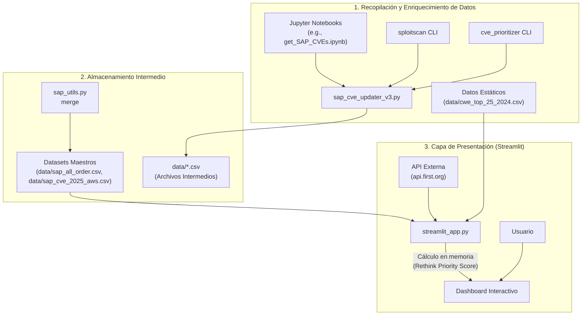

# Arquitectura del Proyecto SAP Vulnerability Compass

Este documento describe la arquitectura y el flujo de datos de la aplicación "SAP Vulnerability Compass". El sistema está diseñado como una pipeline de datos que recopila, enriquece, almacena y visualiza datos de vulnerabilidades de SAP para ayudar en la priorización de parches.

## Diagrama de Flujo de Datos

El siguiente diagrama Mermaid ilustra el flujo de datos a través de los diferentes componentes del sistema.

## Descripción de los Componentes

### 1. Recopilación y Enriquecimiento de Datos
- **Jupyter Notebooks (`notebooks/`)**: El proceso comienza aquí, donde scripts exploratorios recopilan listas iniciales de CVEs de SAP.
- **`sap_cve_updater_v3.py`**: Este es el núcleo del ETL. Toma las listas de CVEs y las enriquece utilizando herramientas externas de línea de comandos.
- **`sploitscan` & `cve_prioritizer`**: Estas herramientas externas obtienen datos cruciales como puntuaciones CVSS, EPSS, estado de KEV (Known Exploited Vulnerabilities) y otras métricas de priorización.
- **Datos Estáticos (`data/cwe_top_25_2024.csv`)**: Archivos como la lista del CWE Top 25 se utilizan para añadir contexto adicional durante el análisis.

### 2. Almacenamiento Intermedio
- **Archivos Intermedios (`data/*.csv`)**: El script de enriquecimiento genera archivos CSV con los datos recopilados.
- **`sap_utils.py`**: Contiene utilidades para gestionar los datos. Su clase `CSVMerger` es clave para consolidar múltiples archivos CSV (por ejemplo, datos históricos y actualizaciones mensuales) en datasets maestros.
- **Datasets Maestros (`data/sap_all_order.csv`, `data/sap_cve_2025_aws.csv`)**: Estos son los archivos CSV finales y consolidados que actúan como la fuente de datos principal para la aplicación de visualización.

### 3. Capa de Presentación (Streamlit)
- **`streamlit_app.py`**: Es la aplicación web interactiva que sirve como interfaz de usuario.
- **Carga de Datos**: Al iniciarse, la aplicación carga los datasets maestros desde el directorio `data/`.
- **Análisis en Vivo y Cálculo**: Cuando un usuario interactúa con funciones como "Rethink Priorities", la aplicación realiza dos acciones clave en memoria:
    1.  Realiza una llamada a una **API externa (`api.first.org`)** para obtener datos de tendencias de EPSS de los últimos 30 días.
    2.  Calcula el **"Rethink Priority Score"**, una puntuación compuesta definida en `data/model.md`, que combina CVSS, EPSS (incluida su tendencia), estado KEV y si pertenece al CWE Top 25.
- **Dashboard Interactivo**: Finalmente, presenta los datos y las puntuaciones en un dashboard con tablas y gráficos interactivos (usando Plotly), permitiendo al usuario explorar y priorizar las vulnerabilidades.
