# SAP Compass Vulns - Scoring to Prioritize vulns


SAP Security Notes - Vulns CVEs Priority and EPSS.

### Create .streamlit/secrets.toml

```
NIST_API = ""
VULNCHECK_API = "vulncheck_"
```
---

# CVE Prioritizer

CVE Prioritizer is a serverless application that helps prioritize vulnerability patching by combining CVSS, EPSS, and CISA's Known Exploited Vulnerabilities. This tool streamlines the process>

## Architecture

```mermaid
architecture-beta
    group vercel(logos:vercel)[Vercel serveless]

    service gateway(logos:vercel)[API Gateway] in vercel
    service function(logos:vercel)[Serverless Function] in vercel

    group aws(logos:aws)[AWS]

    service s3(logos:aws-s3)[S3 Storage] in aws

    group external[External Services]

    service github(logos:gitlab)[GitHub Repository] in external
    service pip(logos:python)[pip Package Manager] in external

    gateway:L --> R:function
    function:T --> L:s3
    function:R -- B:github
    function:B <-- T:pip

```



